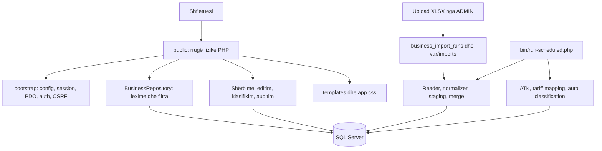

# Kontrolli i arkitekturës dhe gjendja bazë — 2026-10-05

## Identiteti dhe krahasimi me GitHub

- Workspace: `C:\xampp\htdocs\arbk`.
- Repository: https://github.com/brahaluftar/e-arbk ; branch `main`.
- `git fetch origin` përfundoi me sukses. `HEAD` dhe `origin/main`: `dc45aef8a39ee550c345961ffc8e1c356cb4fe34` (`Add women and veteran business filters`).
- `git rev-list --left-right --count HEAD...origin/main`: `0 0`; `git diff --stat HEAD origin/main`: bosh.
- `git status --short` para raportit: bosh. `git ls-remote --heads origin` konfirmoi të njëjtin commit në `main`, branch-i i vetëm i kthyer.
- U shqyrtuan 75 skedarët e versionuar: konfigurimi, PHP, SQL, templates/CSS, dokumentimi dhe deployment. `vendor/` dhe konfigurimi lokal i injoruar nuk përfshihen në barazinë me GitHub.
- Raporti është shtesë dokumentimi lokale; nuk u bë commit, push, migrim apo ndryshim i logjikës.
- Në kontrollin përfundimtar u shfaq edhe një ndryshim lokal në `config/defaults.php`, vetëm te `DB_HOST` (1 rresht i shtuar/1 i hequr). Ky ndryshim nuk u bë nga ky audit dhe u ruajt i paprekur. Prandaj commit-et janë identike me GitHub, por working tree përfundimtar përmban këtë ndryshim konfigurimi dhe raportin e ri. Lidhja DB nuk u ritestua pas këtij ndryshimi.

## Arkitektura reale

Aplikacion monolitik PHP pa framework, me kërkesë PHP ^8.1, Composer PSR-4 `App\\ -> src/`, PDO SQL Server dhe templates server-side. Nuk ka build JavaScript, API publike të biznesit apo front controller qendror. Rrugët janë skedarë fizikë PHP; Apache rewrite ofron disa URL alternative.

| Shtresa | Përgjegjësia |
| --- | --- |
| `bootstrap.php` | Autoload, config, kontroll prodhimi, HTTPS/security headers, session, lidhje PDO, helper-at e renderimit |
| `config/`, `src/Support/` | Defaults → `.env` → variabla ambienti; validim prodhimi |
| `public/auth/`, `src/Security/` | Login/logout, role, CSRF, kufizim tentativash në DB |
| `public/admin/` | Controllers të vegjël për panelin, bizneset, importet, eksportin |
| `src/Repository/` | Query SQL për listim, detaje, kategori, statistika dhe eksport |
| `src/Service/` | Transaksione për ATK, klasifikim, mapping, editim manual dhe audit |
| `src/Import/`, `src/Export/` | Lexim/shkrim XLSX, normalizim, staging dhe merge |
| `templates/`, `public/assets/app.css` | UI shqip, layout i përbashkët, forma, tabela dhe responsive CSS |
| `database/migrations/` | 12 migrime `0001`–`0012`, ekzekutim në transaksion për skedar, ndarje me `GO` |
| `bin/`, `deploy/` | Migrime, krijim admini, punë batch, scheduler, preflight, backup dhe cron |
| `tests/` | Vetëm një test për gjenerimin XLSX |

Controllers përdorin edhe SQL direkt në disa vende. Bootstrap web përdoret edhe nga CLI, duke krijuar session dhe DB connection për çdo komandë. Nuk ka container DI, handler qendror gabimesh apo pipeline CI të versionuar.

## Modeli i të dhënave dhe rregullat

- Tabelat bazë `ARBK_LIST`, `ATK_LIST`, `NACE_LIST` priten paraprakisht; migrimet nuk ndërtojnë një databazë krejt të zbrazët. `ARBK_LIST` modifikohet realisht nga importi, editimi dhe mapping/klasifikimi.
- Identitet biznesi: `REGULATION_ID`; importi përputh sipas `NRBIZ`. `ARBKrowGUID` ruhet si identitet GUID. Migrimi 0009 shton sequence/default për ID të rinj.
- Identiteti i kategorisë është `NACErowGUID`, jo `REGULATIONID` i NACE që dokumentimi historik e përshkruan si jo unik.
- `business_atk_status` materializon statusin e normalizuar; përputhja përdor NRB të trimuar. Pa përputhje jep `ACTIVE`; një status distinct jep `DEACTIVATED`; disa statuse japin `NEEDS_REVIEW`.
- `business_nace_assignments` ruan histori, metodë AUTO/MANUAL dhe snapshot tarife. Unique filtered index lejon vetëm një klasifikim aktiv për biznes.
- AUTO kërkon saktësisht një përputhje kod + përshkrim veprimtarie dhe mungesë klasifikimi aktiv. MANUAL pranon vetëm GUID të një kategorie me të njëjtin kod NACE si biznesi.
- `TariffMappingService` plotëson vetëm target-e NULL. Aktivitetin e kërkon sipas përshkrimit; GUID sipas kodit + përshkrimit. AUTO/MANUAL mund t'i shkruajnë target-et gjatë klasifikimit.
- Ka disa vlera tarifore me kuptime të ndryshme: `NACE_LIST.Tarifa`, `ARBK_LIST.NACE_REG_TARIFF`, `tarifa_me_lirim`, `business_nace_assignments.tariff_snapshot`. Lista shfaq snapshot-in; nuk ka motor automatik llogaritjeje lirimesh.
- Importet `ALL`, `WOMEN`, `CLOSED`: vetëm qyteti i normalizuar/trimuar ekzakt `Prishtinë`; NACE ndahet në kod/përshkrim; sektori pastrohet; WOMEN vendos flag-un e gruas pa hamendësuar përqindje; CLOSED vendos `Statusi=Shuar`.
- Upload deduplikohet nga SHA-256 + lloji. Worker pretendon një rresht QUEUED me locking; lexon sheet1, shkruan staging në grupe prej 2000 përmes OPENJSON dhe bën MERGE në transaksion. Për NRB të përsëritur zgjidhet rreshti i fundit para kontrollit të validitetit.
- Scheduler çdo 15 minuta: një import → ATK → mapping → AUTO → pastrim rate limits. Lock-u `flock` vlen për host-in lokal dhe këtë scheduler; nuk koordinon çdo komandë CLI apo host-e të tjerë.
- Eksporti përdor të gjithë rezultatin e filtruar, jo vetëm faqen; stringjet shkruhen si inline strings. Ka kufi të heshtur prej 1,048,575 rreshtash të dhënash në një sheet.
- Auditimi i ndryshimeve manuale mban para/pas; importi mban staging dhe audit përmbledhës për run, jo snapshot para/pas për çdo biznes.

## Rolet dhe siguria

| Veprimi | ADMIN | OFFICIAL | READ_ONLY |
| --- | --- | --- | --- |
| Panel, lista, detaje, filtra, eksport | Po | Po | Po |
| Editim biznesi dhe klasifikim manual | Po | Po | Jo |
| Upload dhe historiku i importeve | Po | Jo | Jo |

Pikat pozitive: password hashing, session ID regeneration gjatë login, kontroll përdoruesi aktiv nga DB, POST + CSRF në veprimet web që shkruajnë, query të parametrizuara, escaping HTML, CSP, cookies HttpOnly/SameSite, transaksione me audit dhe ruajtje e XLSX jashtë `public/`.

Deployment i rekomanduar përdor `public/` si document root. Kur përdoret root-i i projektit, mbrojtja varet nga `.htaccess` dhe Apache; rregullat e projektit nuk ndalojnë shprehimisht `.git/`, ndaj duhet verifikuar konfigurimi efektiv i serverit. Besimi në proxy headers është flag global, pa allowlist IP; aktivizohet vetëm kur kufiri i proxy-t kontrollohet. Disa CLI mutative nuk kontrollojnë PHP_SAPI (`migrate`, `sync-atk`, `sync-tariff-mappings`, `classify-nace`), prandaj izolimi nga web mbetet i rëndësishëm.

## Gjetjet për ndryshimet e ardhshme

Prioritetet më poshtë dallojnë prova lokale, përfundime statike dhe rreziqe që kërkojnë DB/integrim. Nuk po pretendohet se numri i rekordeve të prekura është verifikuar.

| ID / prioritet | Gjetja dhe ndikimi | Evidenca |
| --- | --- | --- |
| ENV-1 / bllokues lokal | `vendor/autoload.php` dështon sepse referon `phpunit/phpunit/src/Framework/Assert/Functions.php` që mungon. Nisja normale bllokohet në këtë PHP CLI. | Require i drejtpërdrejtë i autoload prodhoi fatal error; PHPUnit executable gjithashtu mungon. |
| ENV-2 / bllokues XLSX lokal | PHP CLI 8.2.4 nuk ka `ext-zip`; importi/eksporti nuk mund të ekzekutohen në këtë runtime. | `php -m`; `composer check-platform-reqs --no-dev` raporton missing ext-zip. |
| LOG-1 / i lartë | Statusi i materializuar ka përparësi ndaj `ATK_MBYLLUR`. Biznesi i vendosur pasiv/mbyllur mund të vazhdojë të shfaqet ACTIVE kur ka status të materializuar ACTIVE; sync pa match ATK vendos sërish ACTIVE. | `src/Service/AtkStatusService.php:19`, `src/Repository/BusinessRepository.php:20`, `BusinessEditService.php:36`; e njëjta shprehje në view/listë/detaje/dashboard/eksport. |
| LOG-2 / i lartë | Ndryshimi manual i kodit NACE zbraz fushat tarifore dhe përfundon assignment-in, por lë GUID-in e vjetër `NaceRowGuid`. Sync plotëson vetëm GUID NULL; lidhja mund të mbetet e gabuar nëse nuk bëhet klasifikim i ri. Importi, në ndryshim nga editimi, e zbraz GUID-in. | `src/Service/BusinessEditService.php:45`–48; `TariffMappingService.php:37`; `BusinessImportService.php:70`. |
| LOG-3 / i lartë | Importi `Pasiv` pa datë prodhon `passive=0`; data `31/02/2026` pranohet si `2026-03-03` pa validation_error. E njëjta dobësi e parse-it ekziston në statusin e editimit manual. | Prova të izoluara më poshtë; `BusinessImportNormalizer.php:20`–22, `BusinessEditService.php:35`. |
| LOG-4 / i lartë | CLOSED ndryshon statusin tekstual në Shuar, por MERGE e vendos `ATK_MBYLLUR=1` vetëm për passive=1. Biznesi i sapoimportuar i shuar mund të paraqitet ACTIVE. | `BusinessImportNormalizer.php:12`; `BusinessImportService.php:77`–80; duhet përcaktuar rregulli i statusit të kombinuar ARBK/ATK. |
| DATA-1 / mesatar | Upload insert + audit nuk janë në një transaksion. Nëse audit dështon pas insert-it, catch fshin XLSX, por run-i QUEUED mund të mbetet në DB me skedar që mungon. | `public/admin/imports/upload.php:13`–14. |
| DATA-2 / mesatar | Worker i ndërprerë pas claim mbetet PROCESSING. Nuk ka lease/timeout/requeue; unique hash+type pengon ringarkimin identik edhe pas dështimit pa ndërhyrje shtesë. | `BusinessImportService.php:17`–18; migrimi 0009. |
| DATA-3 / mesatar | Validimi i kategorisë manuale lexon biznesin/kategorinë para transaksionit. Një editim/import konkurent mund të ndryshojë NACE ndërmjet validimit dhe shkrimit. Nuk ka kontroll row-version për formën e editimit; ruajtja e një forme të vjetër mund të mbishkruajë ndryshime më të reja. | `ClassificationService.php:12`–16; `BusinessEditService.php:43`–47. Rrezik statik, pa provë konkurruese në DB. |
| LOG-5 / mesatar | ATK supozon se çdo status i vetëm distinct është joaktiv, pa map të vlerës reale. Kjo varet nga supozimi historik që ATK_LIST përmban vetëm joaktivë. | `AtkStatusService.php:19`; duhet konfirmuar kontrata e dataset-it para zgjerimit. |
| OPS-1 / mesatar | Reader lexon rreshtat gradualisht, por ngarkon të gjithë sharedStrings në array. Kujtesa nuk është plotësisht e kufizuar; limiti i upload-it të zgjeruar prej 1 GB nuk garanton përpunim brenda memory_limit. | `XlsxRowReader.php:18,36`–41; `upload.php:9`. |
| OPS-2 / mesatar | Composer nuk deklaron `ext-mbstring` dhe `ext-xmlwriter`, megjithëse kodi i përdor. Preflight nuk kontrollon xmlwriter, të gjitha tabelat/kolonat apo që të 12 migrimet janë aplikuar. Health kontrollon DB dhe MAX(applied_at), jo plotësinë e skemës. | `composer.json`; `bin/preflight-production.php`; `public/health.php`. |
| UI-1 / i ulët | Kartat e panelit total/active/deactivated/automatic/manual të gjitha hapin klasifikimin default UNCLASSIFIED; vetëm ambiguous ka filtër të përshtatshëm. | `templates/admin/dashboard.php:2`. |
| MAINT-1 / mesatar | Një test XLSX, pa teste statusesh, importi, rolesh, migrimesh apo concurrency. SQL/status/filtra përsëriten në repository/view/controllers. Dokumenti phase-1 thotë tabela read-only, që nuk përputhet më me implementimin. | `tests/XlsxWriterTest.php`; `docs/phase-1-inspection-and-plan.md`; shërbimet aktuale. |

Vëzhgime të tjera: ndryshimi vetëm i përshkrimit NACE nuk invalidon assignment AUTO; validimi i inputeve të importit mbulon kryesisht NRB dhe formatin NACE, jo të gjitha gjatësitë e kolonave legacy. Duhet skema reale për të provuar kufijtë. Filtri pronare/pronar=0 bashkon NULL me 0. Lirimet regjistrohen manualisht, pa formulë apo proces aprovimi të implementuar. Këto janë sjellje për t'u marrë parasysh gjatë specifikimit të ndryshimeve.

## Verifikimi i kryer

- `php -l` mbi të 48 skedarët PHP të versionuar: të gjithë kaluan.
- `composer validate --strict`: kaloi.
- `composer check-platform-reqs --no-dev`: dështoi për ext-zip.
- `php vendor/phpunit/phpunit/phpunit --bootstrap vendor/autoload.php tests`: nuk ekzekutoi teste, executable mungon.
- Ngarkimi i `vendor/autoload.php`: fatal nga dependency PHPUnit që mungon. Nuk u ndryshua vendor apo konfigurimi PHP gjatë auditit.
- Normalizer u ngarkua drejtpërdrejt, pa bootstrap/autoload/DB, për prova të vogla vetëm në memorie:
  - `Pasiv` → `business_status=Pasiv`, `passive=0`, pa gabim.
  - `Pasiv-31/02/2026` → `passive=1`, `passive_date=2026-03-03`, pa gabim.
  - `Data Shuarjes=31/02/2026` → `closed_date=2026-03-03`, pa gabim.
  - CLOSED pa status burimor → `business_status=Shuar`, `passive=null`.
- Tentativa e lidhjes PDO me config lokal, timeout 5 sekonda dhe vetëm query SELECT të planifikuara, dështoi me SQLSTATE `08001` para query-ve. Skema aktive, migrimet e aplikuara dhe numrat e rekordeve të prekura nuk u verifikuan.
- Nuk u ekzekutuan migrime, importe, sync, klasifikime, krijime llogarish apo backup. Nuk u krye provë browser/HTTP apo verifikim prodhimi. Rezultatet PHP vlejnë për CLI-në lokale, jo domosdoshmërisht konfigurimin Apache.
- Teksti shqip u konfirmua përmes leximit UTF-8/rg; paraqitja e gabuar në disa dalje PowerShell nuk u trajtua si defekt i provuar i skedarëve.

## Pikënisja për punën pasuese

1. Riparo mjedisin e ekzekutimit sipas composer.lock dhe verifiko runtime-in web; mundëso një DB testimi me skemën legacy dhe migrimet.
2. Përcakto rregullin autoritativ të statusit ARBK/Pasiv/Shuar/ATK dhe unifiko llogaritjen në të gjitha pamjet.
3. Rregullo invalidimin e plotë NACE dhe validimin strikt të datave; mbuloji me teste që riprodhojnë skenarët më sipër.
4. Bëj queue + audit konsistent, shto rikuperim për importet e ngecura dhe kontrolle concurrency.
5. Forco verifikimin e deployment-it, testet e integrimit dhe dokumentimin. Ndryshimet e skemës të vazhdojnë me migrime të reja pas 0012.

Të ruhen: rrugët ekzistuese, kufijtë ADMIN/OFFICIAL/READ_ONLY, NACErowGUID si identitet kategorie, historia e assignment-eve, auditimi, filtri Prishtinë, eksporti me të gjithë filtrat dhe mosmbishkrimi i vlerave manuale nga sync që plotëson NULL. Faturimi, UNIREF, portal, email dhe AI janë plane historike, jo funksionalitete ekzistuese të këtij repository.
